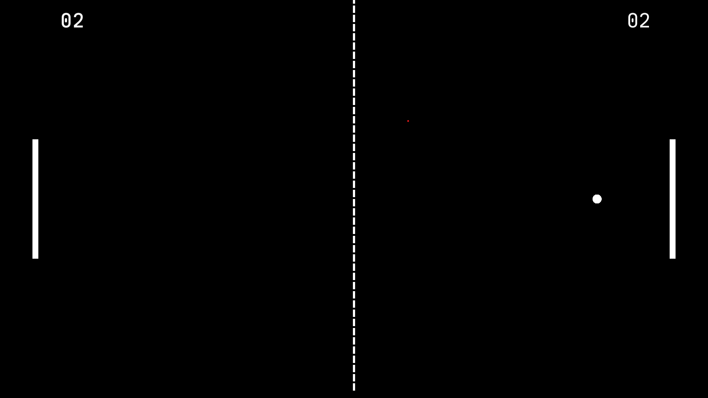
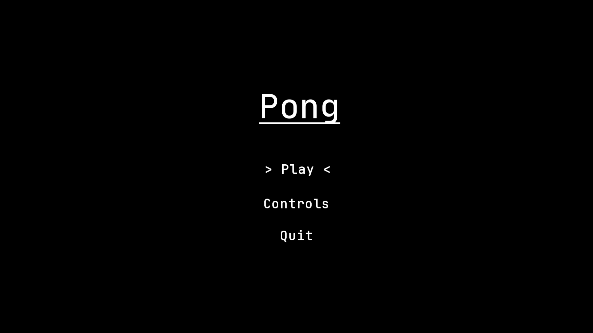
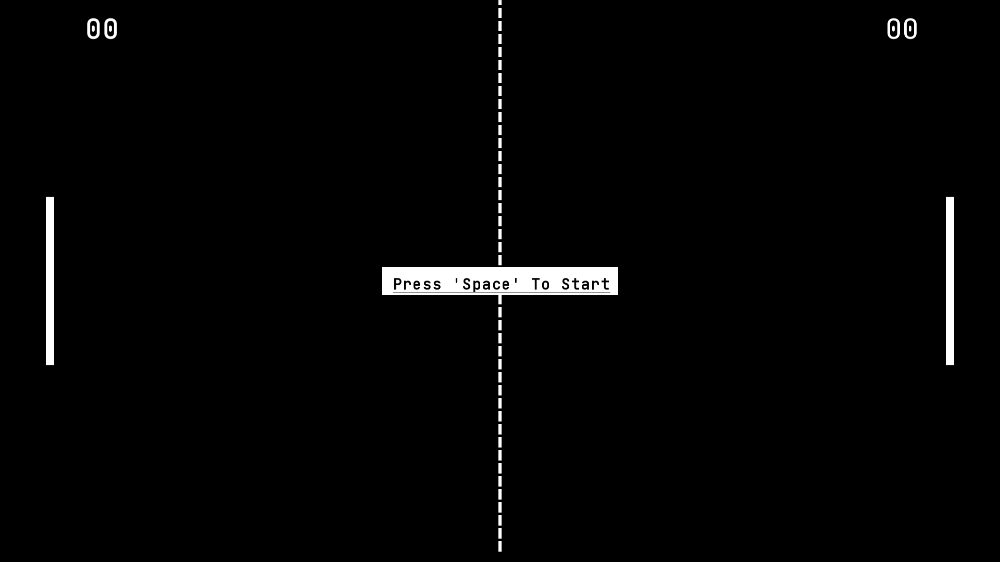
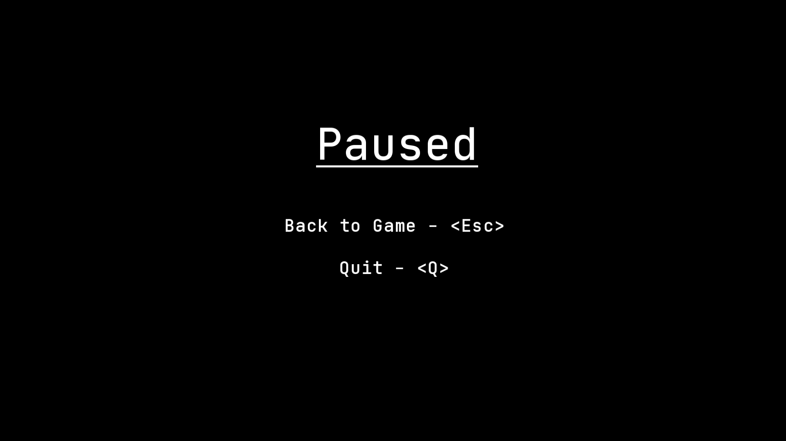

+++
title = "Pong"
description = "Pong"
date = 2023-03-17T19:42:00+00:00
updated = 2023-06-22T16:00:00+00:00
draft = false
sort_by = "title"
template = "docs/page.html"

[extra]
lead = "Pong built with C++, SFML and Crank."
toc = true
top = false
+++

Simple Pong game written in C++ using SFML, Crank and built using Meson. This project is pretty hacky and mostly serves as a project to test the usage of the Crank state framework.

## Screen Shots

### Main Game

### Start Screen

### Main Game Start

### Pause Menu

### Controls Menu

